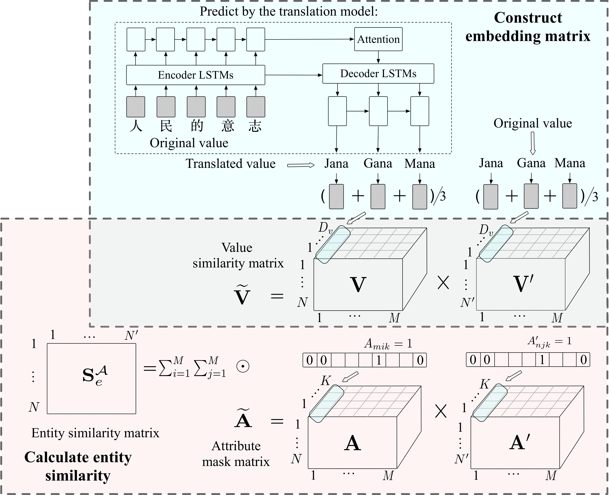

# PAKDD-20-JarKA
Pytorch implemetation of PAKDD'20---"JarKA: Modeling Attribute Interactions for Cross-lingual Knowledge Alignment"


MUSE is a Python library for *multilingual word embeddings*, whose goal is to provide the community with:
* state-of-the-art multilingual word embeddings ([fastText](https://github.com/facebookresearch/fastText/blob/master/pretrained-vectors.md) embeddings aligned in a common space)
* large-scale high-quality bilingual dictionaries for training and evaluation

We include two methods, one *supervised* that uses a bilingual dictionary or identical character strings, and one *unsupervised* that does not use any parallel data (see [Word Translation without Parallel Data](https://arxiv.org/pdf/1710.04087.pdf) for more details).

## Dependencies
* Python 2/3 with [NumPy](http://www.numpy.org/)/[SciPy](https://www.scipy.org/)
* [PyTorch](http://pytorch.org/)
* [Faiss](https://github.com/facebookresearch/faiss) (recommended) for fast nearest neighbor search (CPU or GPU).

MUSE is available on CPU or GPU, in Python 2 or 3. Faiss is *optional* for GPU users - though Faiss-GPU will greatly speed up nearest neighbor search - and *highly recommended* for CPU users. Faiss can be installed using "conda install faiss-cpu -c pytorch" or "conda install faiss-gpu -c pytorch".

## Get evaluation datasets
To download monolingual and cross-lingual word embeddings evaluation datasets:
* Our 110 [bilingual dictionaries](https://github.com/facebookresearch/MUSE#ground-truth-bilingual-dictionaries)
* 28 monolingual word similarity tasks for 6 languages, and the English word analogy task
* Cross-lingual word similarity tasks from [SemEval2017](http://alt.qcri.org/semeval2017/task2/)
* Sentence translation retrieval with [Europarl](http://www.statmt.org/europarl/) corpora

You can simply run:

```bash
cd data/
wget https://dl.fbaipublicfiles.com/arrival/vectors.tar.gz
wget https://dl.fbaipublicfiles.com/arrival/wordsim.tar.gz
wget https://dl.fbaipublicfiles.com/arrival/dictionaries.tar.gz
```

Alternatively, you can also download the data with:
